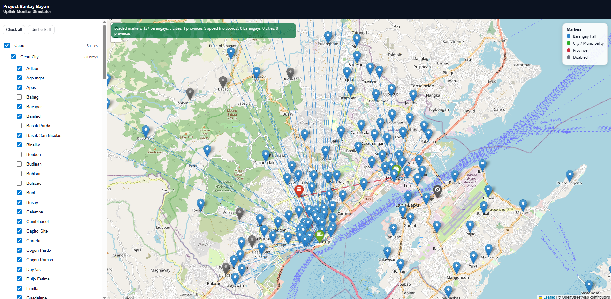

# Project Bantay Bayan - Uplink Monitor Simulator

An offline-first connectivity simulator for Project Bantay Bayan that visualizes how barangays, cities/municipalities, and the province can stay connected for daily support, disaster response, and recovery even when internet, telco signal, or grid power is down.

Demo: https://jybanez.github.io/simulator.uplink.pbb.com/



## Why this simulator matters

- Day-to-day readiness: lets EOCs practice routine information flow, validate coverage, and spot weak links before a crisis.
- Disaster response: models how reports and needs data can move between barangays, cities/municipalities, and the province under constrained connectivity.
- Recovery operations: supports coordinated updates and verification when infrastructure is unreliable or offline.
- Local autonomy: each EOC runs its own Project Bantay Bayan system, and this simulator shows how they sync when connectivity becomes available.

## What it does

- Interactive map of barangay, city/municipality, and province nodes.
- Toggle connections in a hierarchical tree view to simulate uplink availability.
- Visual status for active, inactive, and disabled markers.
- Fully local assets to keep the demo offline-friendly.
- In a live deployment, connectivity status would refresh automatically as outages occur or links come back online.

## Offline-first principles

- Local-first operation: the simulator runs entirely from local files and does not depend on network services.
- Resilient workflows: users can rehearse coordination even when internet, telco signal, or grid power is down.
- Sync-on-availability: when connectivity returns, uplink state can refresh and reconcile changes automatically.

## Data and structure

- `Barangays.csv`, `Cities.csv`, `Provinces.csv` provide location data.
- `index.html` loads local Leaflet assets for offline use.
- `js/main.js` handles CSV parsing, map rendering, and connectivity logic.

## Run locally

Open `index.html` directly in a browser. No build step required.

If your browser blocks local file requests, run a simple static server instead:

```powershell
python -m http.server 8080
```

Then visit `http://localhost:8080`.

## How to use

- Open the simulator in a browser (local or demo link).
- Use the left panel to check or uncheck barangays, cities/municipalities, and provinces.
- Watch the map update to reflect active uplink paths and disabled nodes.
- Use this to rehearse coordination flows and identify connectivity gaps.

### Example workflows

**Daily operations check**
- Turn on a full province or municipality to confirm baseline coverage.
- Disable a few barangays and verify how gaps appear on the map.
- Re-enable and confirm expected recovery paths.

**Disaster response drill**
- Simulate a partial outage by disabling a city/municipality.
- Enable only a subset of barangays and trace their uplink routes.
- Use the map to decide where to deploy mobile relays or field teams.

**Recovery and re-sync**
- Bring nodes back online in stages (barangay, then city, then province).
- Confirm status updates propagate as connectivity returns.
- Document weak points for infrastructure hardening.

## Limitations

- This is a connectivity simulator, not a full incident management or dispatch system.
- Data is static CSV for demo purposes; live deployments would use real-time feeds.
- Visual paths represent simulated uplinks and do not model bandwidth, latency, or RF constraints.

## License

Creative Commons Attribution 4.0 International (CC BY 4.0). See `LICENSE`.
https://creativecommons.org/licenses/by/4.0/
